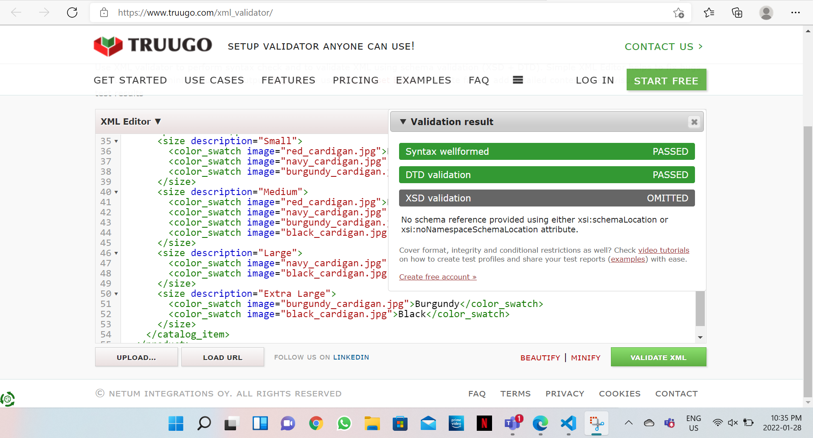
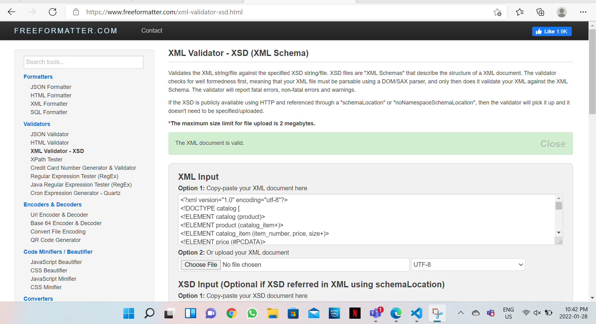

1. XML file with DTD VALIDATION

2. XSD file Validation

3. I firstly created my DTD for my XML file which I was provided. I listed out all the elements and 
the attributes that were required. Using the DTD file I did my xml validation which was successful.
I wrote the path of my DTD in xml file.
After that I created my XSD file in which I used complexType and sequence and many other different tags.
Using another software provided, I validated my xsd and xml file that was a success.